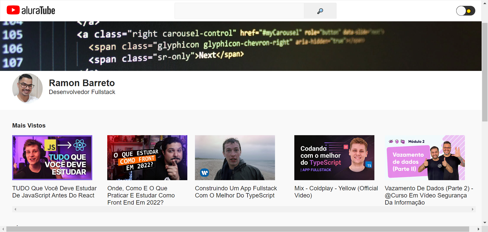
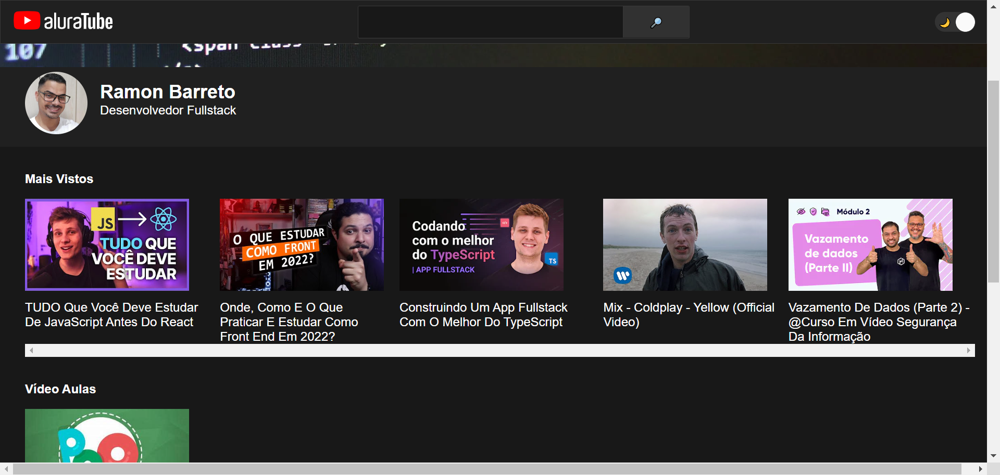

  

## Projeto - Imersão React Alura 👨🏽‍💻

Site desenvolvido como resultado dos aprendizados obtidos na Imersão React - Alura, desenvolvendo o projeto Aluratube, uma réplica do youtube.

- [x] Criação de uma réplica do Youtube - Aluratube

## Preview - Light mode

  

## Preview - Dark mode

  

## Tecnologias 🛠

- [JavaScript](https://www.javascript.org/)
- NextJS
  
## Layout 🔲 - Figma(Alura)

Você pode visualizar o layout do projeto através do link abaixo:

- [Layout](https://www.figma.com/file/1acrju7CLwHkSh6e7xEk9h/Aluratube?node-id=0%3A1&t=fSsMs2uITSMu8QiJ-1)

Lembrando que você precisa ter uma conta no [Figma](http://figma.com/).

## Instrutores 👨🏽‍🏫

- Nayanne Lopes
- Mario Souto (DevSoutinho)
- Paulo Silveira

